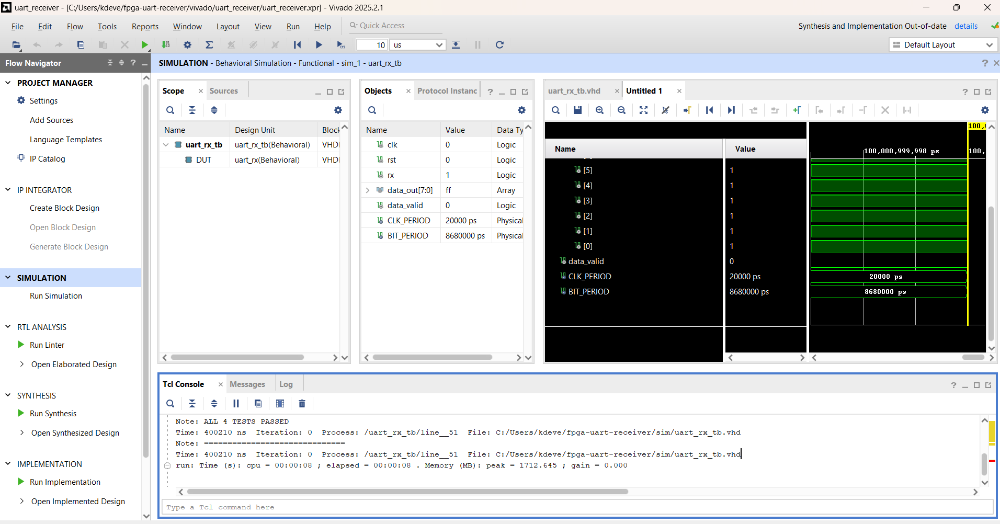

# FPGA UART Receiver — VHDL

A UART receiver implemented in VHDL with a self-checking testbench, simulated end-to-end in Vivado without physical hardware. Designed to demonstrate hardware/software co-design and pre-silicon FPGA validation methodology.

## Overview

Implements a complete UART receive chain operating at 115200 baud on a 50 MHz clock (Artix-7 target):

- Start bit detection with midpoint sampling for noise rejection
- 8-bit LSB-first data capture with per-bit baud-rate alignment
- Stop bit validation and single-cycle data_valid handshake
- Synchronous reset for deterministic initialisation

## Validation Methodology

A self-checking VHDL testbench (uart_rx_tb.vhd) drives the design under test with 4 test vectors chosen to stress different failure modes:

| Test | Value | Rationale |
|------|-------|-----------|
| 1 | 0x55 | Alternating bits — stresses baud rate sampler |
| 2 | 0xA3 | Mixed pattern — catches bit ordering errors |
| 3 | 0x00 | All zeros — tests extended low-line detection |
| 4 | 0xFF | All ones — verifies idle state not misread |

Assertions verify correct output for each vector. All 4 tests pass — see simulation results below.

## Simulation Results

Tcl console output confirming all tests passed:

    PASS Test 1: 0x55 received correctly
    PASS Test 2: 0xA3 received correctly
    PASS Test 3: 0x00 received correctly
    PASS Test 4: 0xFF received correctly
    ALL 4 TESTS PASSED

## Tools

- **Language:** VHDL (IEEE 1076-2008)
- **Simulator:** Vivado ML 2025.2 (no hardware required)
- **Target device:** Artix-7 xc7a35t (simulation only)
- **Methodology:** Pre-silicon behavioural simulation

## Project Structure

    fpga-uart-receiver/
    ├── src/uart_rx.vhd        UART receiver RTL design
    ├── sim/uart_rx_tb.vhd     Self-checking VHDL testbench
    ├── docs/waveform.png      Vivado simulation waveform
    └── README.md

## Author

Devendra Reddy Keesara
MSc Embedded Systems & IC Design, Liverpool John Moores University
github.com/deva1611
